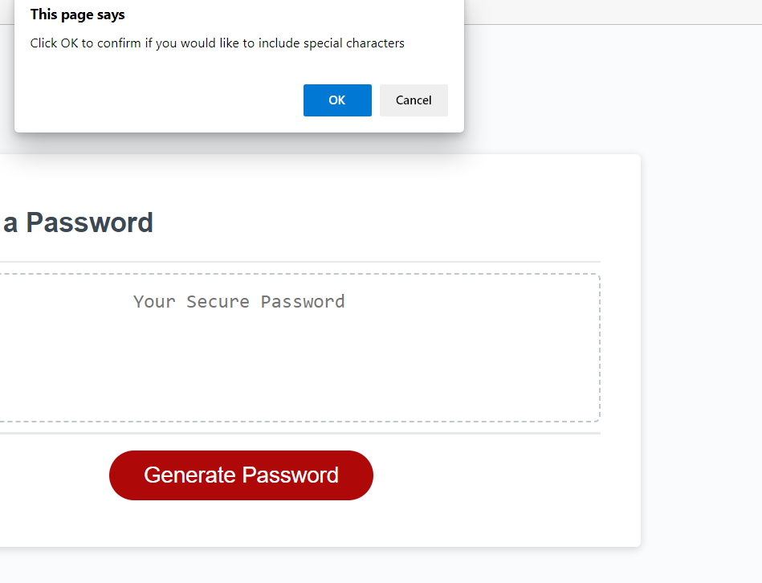

# password-Generate-

# Picture Home Pages





## Technologies Used

- HTMl - used to create main page
- Css - Styles html page
- Git - version control
- Github - deploying website
- JavaScript

## Code Snippet

```
function generatePassword() {
  var confirmLength = prompt(
    "How many characters would you like your password to contain?"
  );

  // Loop for length
  while (confirmLength <= 7 || confirmLength >= 127) {
    alert("Password length must be between 8-128 characters Try again");
    var confirmLength = prompt(
      "How many characters would you like your password to contain?"
    );
  }

  // Repeat back how many charactes the user will have
  alert("your password length" + confirmLength);

  // Determine parameters of password
  var confirmSpecialCharacter = confirm(
    "Click OK to confirm if you would like to include special characters"
  );
  var confirmNumericCharacter = confirm(
    "Click OK to confirm if you would like to include numeric characters"
  );
  var confirmLowerCase = confirm(
    "Click OK to confirm if you would like to include lowercase characters"
  );
  var confirmUpperCase = confirm(
    "Click OK to confirm if you would like to include uppercase characters"
  );
  // Loop if answer is outside the parameters
  while (
    confirmUpperCase === false &&
    confirmLowerCase === false &&
    confirmSpecialCharacter === false &&
    confirmNumericCharacter === false
  ) {
    alert("You must choose at least one parameter");
  }

  // Assign an action to the password parameters NEED TO FIX THIS
  var passwordCharacters = [];

  if (confirmSpecialCharacter) {
    passwordCharacters = passwordCharacters.concat(specialChar);
  }

  if (confirmNumericCharacter) {
    passwordCharacters = passwordCharacters.concat(number);
  }

  if (confirmLowerCase) {
    passwordCharacters = passwordCharacters.concat(alphaLower);
  }

  if (confirmUpperCase) {
    passwordCharacters = passwordCharacters.concat(alphaUpper);
  }

  console.log(passwordCharacters);

  // Empty string to be filled based on for loop selecting random characters from the array
  var randomPassword = "";

  for (var i = 0; i < confirmLength; i++) {
    randomPassword =
      randomPassword +
      passwordCharacters[Math.floor(Math.random() * passwordCharacters.length)];
    console.log(randomPassword);
  }
  return randomPassword;
}
```

### This code used for navigation websites

## Tools

1. VsCode
2. Git (windows)
3. Github

# Getting Start

This project is about how to use html css. There are few steps to run this project.

## Prerequisites

Software need to be install

- Vscode
- git
- github(clone project)

# Installation

1. Setup SSH key
2. Git clone to terminal or gitbash
   (https://github.com/akash2040/password-Generate-)
3. Enter github password

### Project is ready to use Open index.html to default browser

## Author Links

[Github](https://github.com/akash2040/password-Generate-)

# Deploy websites

https://akash2040.github.io/password-Generate-/
